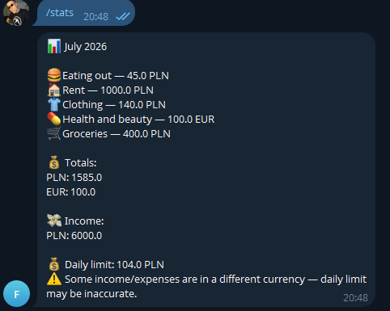
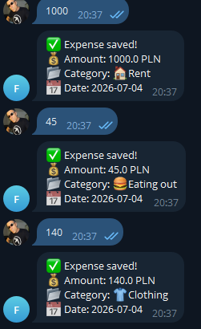
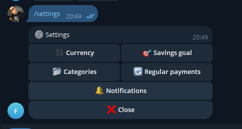

# FinTrack 
@fintrack_multitoolbot
A personal finance tracker you control entirely through Telegram — log expenses and income, track spending by category, and get a daily spending limit calculated automatically from your income, savings goal, and what you've already spent.

## Screenshots are down below ! 


​```
Telegram Bot  →  Django REST API  →  PostgreSQL
​```

## Features

- Log expenses and income via chat
- Monthly stats: spending by category, income, smart daily limit
- Recurring payments, auto-logged monthly
- Daily reminders (toggleable)
- Multi-currency support (PLN, UAH, EUR, USD)
- `/help` guide built into the bot

## Tech stack

**Backend:** Django, Django REST Framework, PostgreSQL, Token auth
**Bot:** python-telegram-bot, httpx, APScheduler (background jobs)
**Testing:** pytest, pytest-django
**Infra:** Docker, Docker Compose, GitHub Actions (CI), deployed on a Hetzner VPS

## Status

Fully functional and deployed — running 24/7 on a VPS via Docker. Tests run automatically on every push via GitHub Actions.





